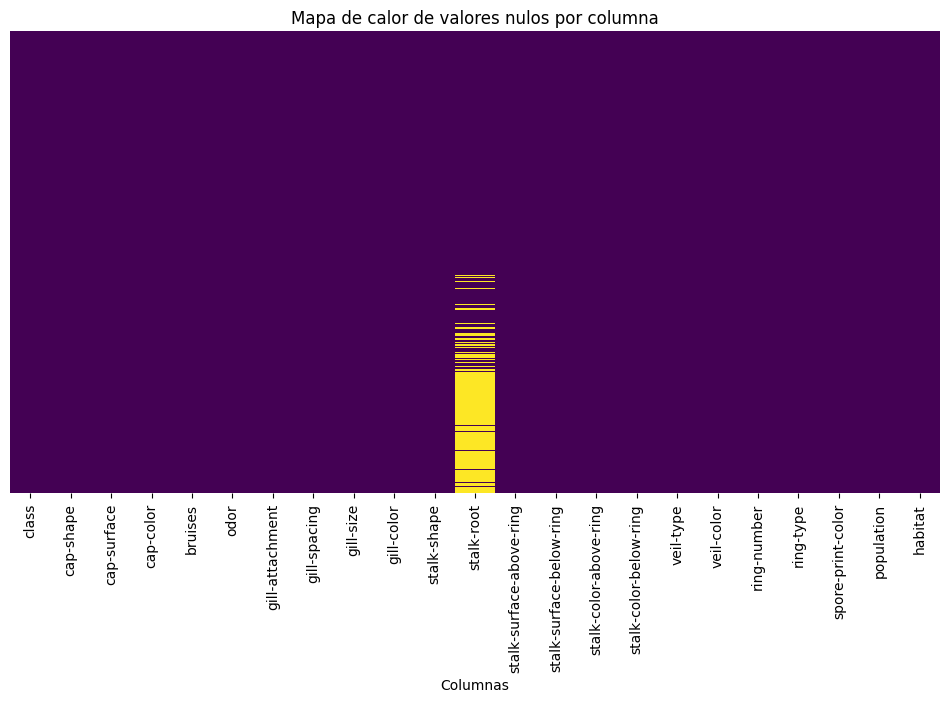

# Informe del Proyecto Mushroom - EDA y Modelado

## 1. Introducción al Proyecto

En este proyecto, se ha desarrollado un análisis exploratorio de datos (EDA) y un modelo de clasificación utilizando un dataset sobre hongos. El objetivo es identificar las características más relevantes que permiten clasificar un hongo como comestible o venenoso, aplicando técnicas de preprocesamiento, visualización y modelado predictivo.

El dataset utilizado contiene diversas características sobre los hongos, incluyendo atributos como el color, el tipo de sombrero, la superficie, entre otros. Estos atributos se han utilizado tanto para el análisis exploratorio como para la creación del modelo predictivo.

---

## 2. Exploración y Análisis de Datos (EDA)

### 2.1 Carga y Descripción del Dataset

Para comenzar, hemos cargado y revisado los datasets, asegurándonos de entender la estructura de las variables y su distribución. Se realizaron las siguientes acciones:

- Eliminación de duplicados.
- Conversión de variables categóricas a numéricas mediante técnicas de codificación (Label Encoding y One-Hot Encoding).
- Identificación de valores nulos.

A continuación, se presenta un mapa de calor que nos permite identificar rápidamente la presencia de valores nulos en las columnas del dataset:

### 2.2 Matriz de Correlación: V de Cramér

Para entender mejor las relaciones entre las variables categóricas, calculamos la matriz de V de Cramér. Este análisis nos permitió identificar pares de variables con alta correlación, lo cual es esencial para detectar redundancias y posibles dependencias entre características.

La matriz completa se presenta a continuación:

### 2.3 Enfoque en Correlaciones Fuertes

Finalmente, filtramos aquellas relaciones con un valor de V de Cramér igual o superior a 0.7. Este umbral nos ayuda a centrar la atención en las variables más relevantes y con mayor potencial predictivo:

---

## 3. Modelado y Entrenamiento

### 3.1 Selección del modelo

En este proyecto, se han implementado varios modelos de clasificación para evaluar su rendimiento:

- Decision Tree Classifier
- Logistic Regression
- Random Forest Classifier

Se ha utilizado `StratifiedKFold` para mantener la proporción original de clases y `GridSearchCV` para la optimización de hiperparámetros.

### 3.2 Preparación de los datos

- Conversión de variables categóricas a numéricas mediante `OneHotEncoder`.
- División del dataset en conjuntos de entrenamiento y prueba (80/20).
- Aplicación de técnicas de escalado de datos y normalización.

### 3.3 Entrenamiento y ajuste del modelo

- Los modelos se han entrenado mediante pipelines integrados y `GridSearchCV` para optimizar parámetros clave.

### 3.4 Evaluación del rendimiento del modelo

- Evaluación mediante `StratifiedKFold` y métricas como precisión (`accuracy`), `recall` y `F1-score`.
- Matriz de confusión para visualizar los errores de clasificación.

---

## 4. Resultados y Conclusiones

- Análisis de los resultados obtenidos y comparación con otros enfoques potenciales.
- Discusión sobre las limitaciones del modelo y posibles mejoras.

---

## 5. Análisis Didáctico y Lecciones Aprendidas

- Reflexión sobre los pasos clave del proyecto, destacando la importancia del EDA y la preparación adecuada de los datos.
- Identificación de áreas de mejora y propuestas para futuros proyectos similares.

---

## Referencias y Recursos

- Documentación utilizada durante el desarrollo del proyecto.
- Enlaces a notebooks y datasets empleados.
